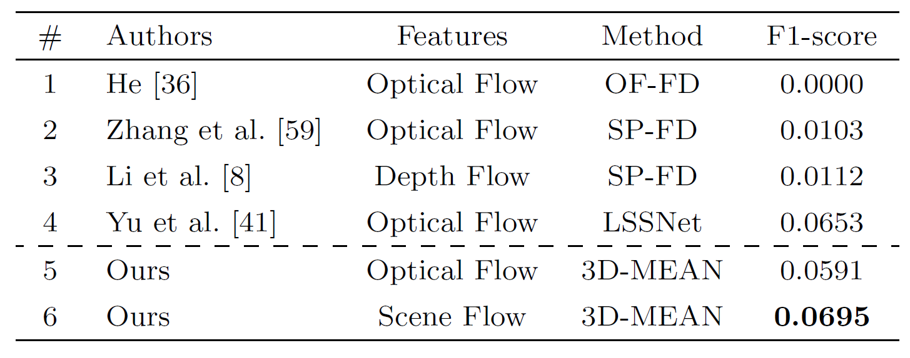
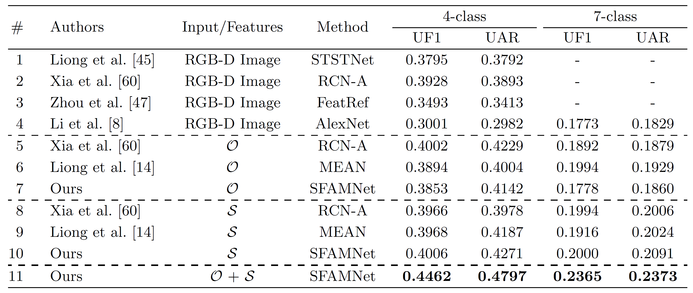

## 3D-MEAN: An End-to-End Micro-Expression Analysis Network based on 3D Motion Flow

## Results
Performance comparison for micro-expression spotting. <br>


Performance comparison for micro-expression recognition. <br>


## How to run the code
<b>Step 1)</b> Download the processed_data from:

<!--
https://drive.google.com/drive/folders/1D5az-DAyzY1C1ZqoZb8Z_o3eTXesAIWT?usp=sharing
-->
<b>hidden at the moment</b>

The files are structured as follows:
>├─annotation <br>
>├─pretrained_weights <br>
>├─Utils <br>
>├─dataloader.py <br>
>├─load_data.py <br>
>├─main.py <br>
>├─network.py <br>
>├─prepare_data.py <br>
>├─requirements.txt <br>
>├─train.py <br>
>├─train_utils.py <br>
>├─<b>processed_data</b> <br>
>>├─<b>CASME_cube_recog_rgbd-flow.pkl</b> <br>
>>└─<b>CASME_cube_spot_rgbd-flow.pkl</b>

<b>Step 2)</b> Installation of packages using pip

``` pip install -r requirements.txt ```

<b>Step 3)</b> Network Training and Evaluation

``` python main.py ```

#### &nbsp; Note for parameter settings <br>
&nbsp;&nbsp; --train (True/False) <br>
&nbsp;&nbsp; --emotion (4/7)

##### Please email me at genbing67@gmail.com if you have any inquiries or issues.
